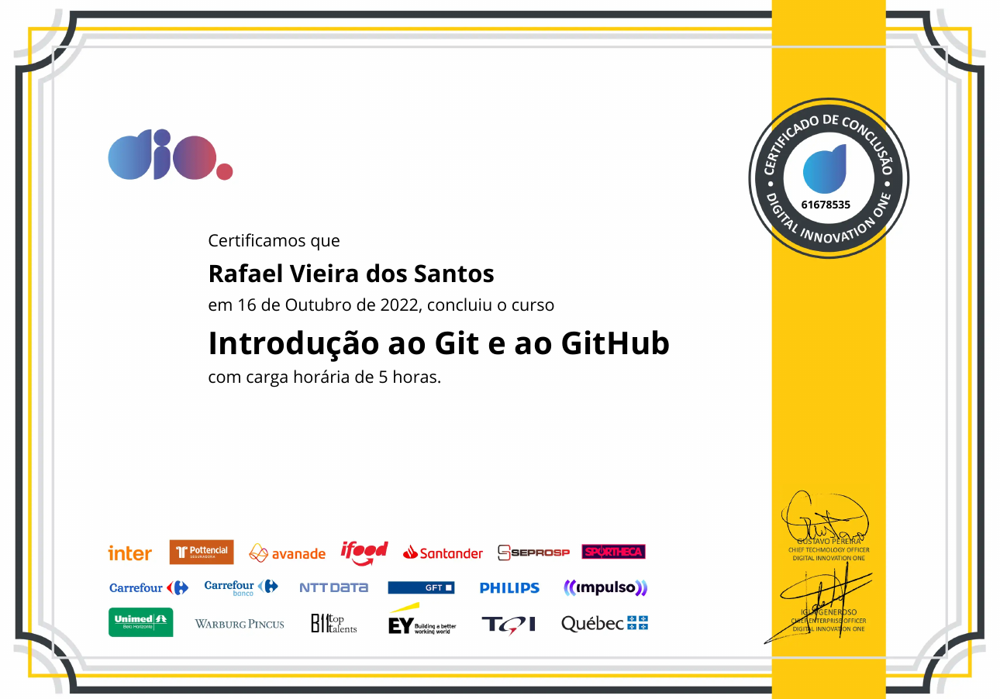
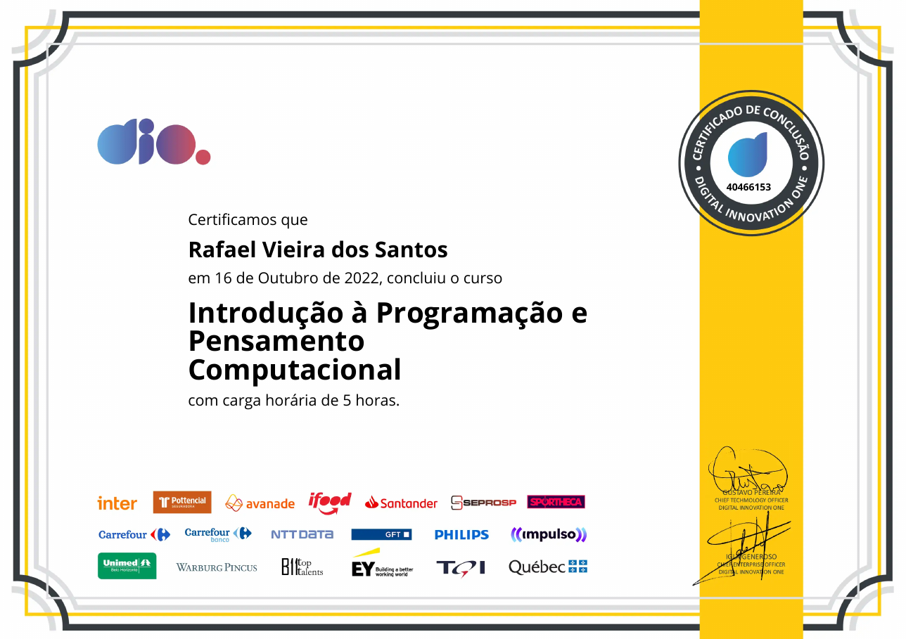
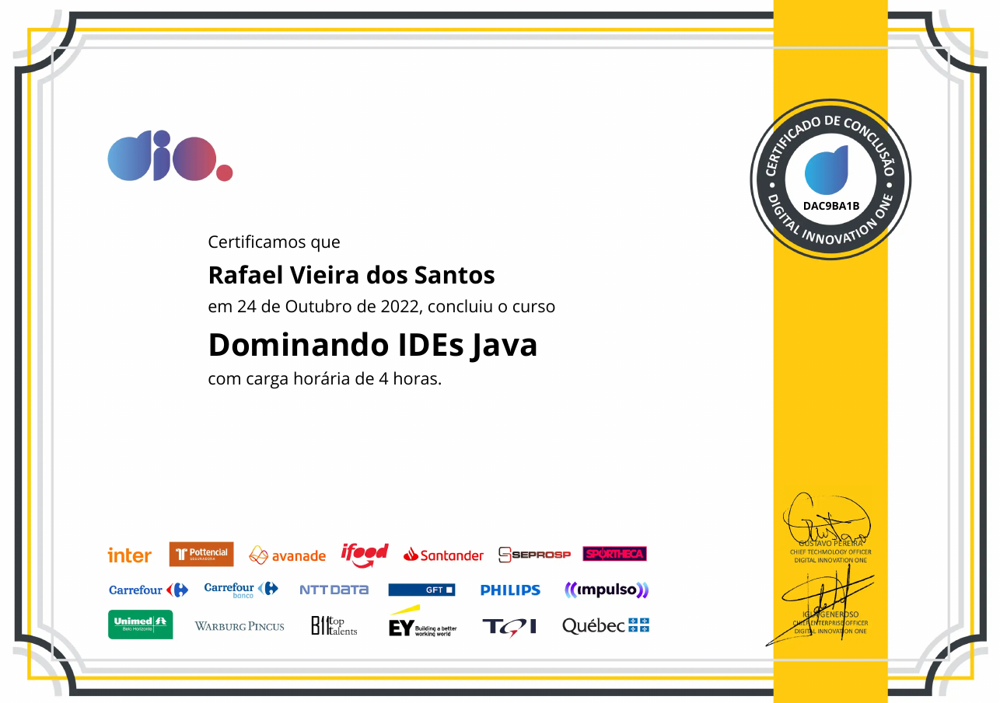
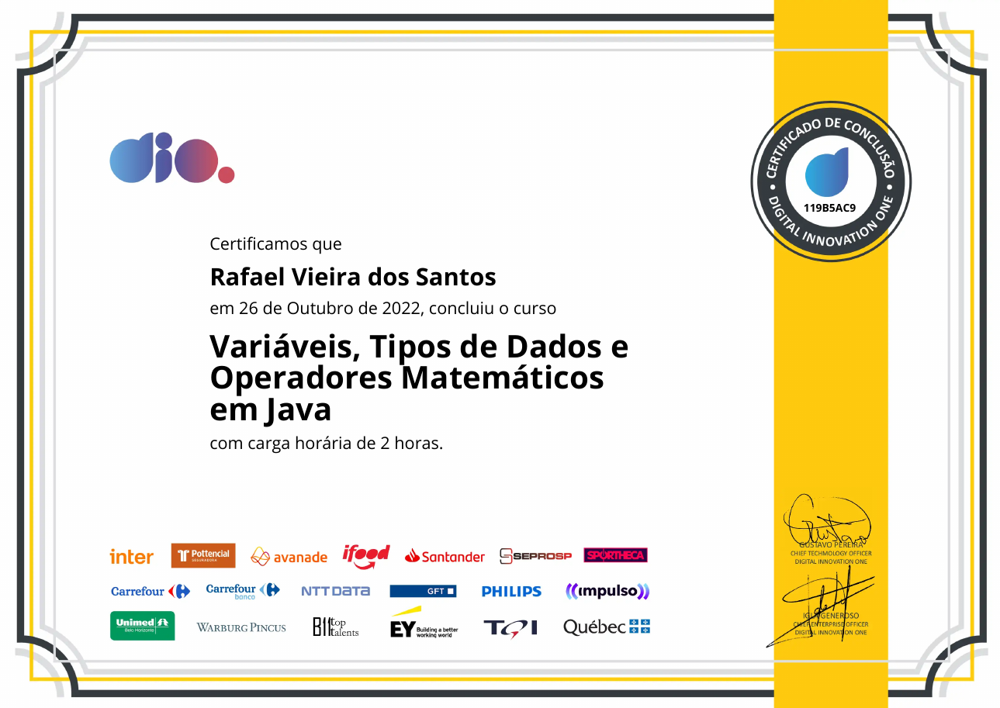
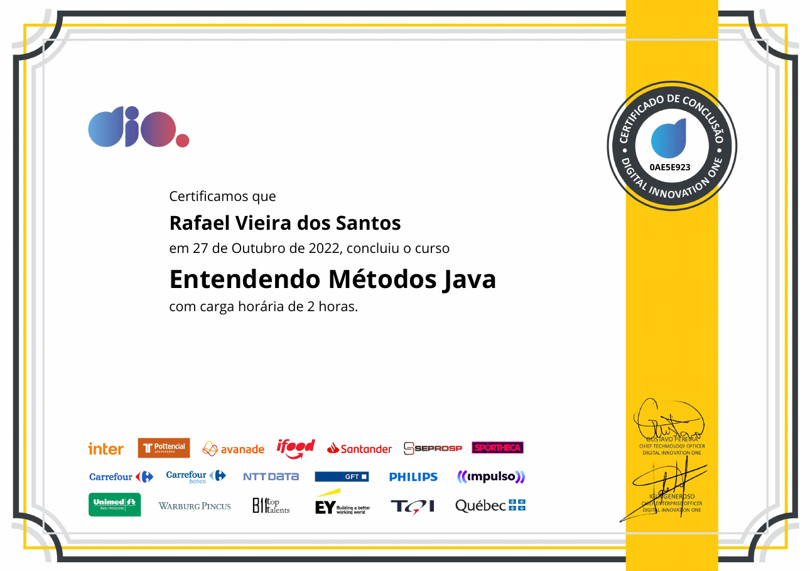
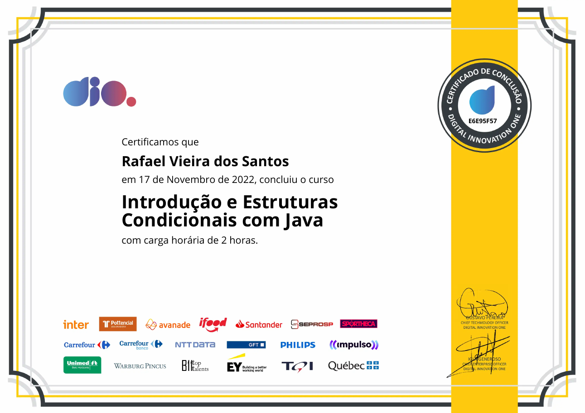
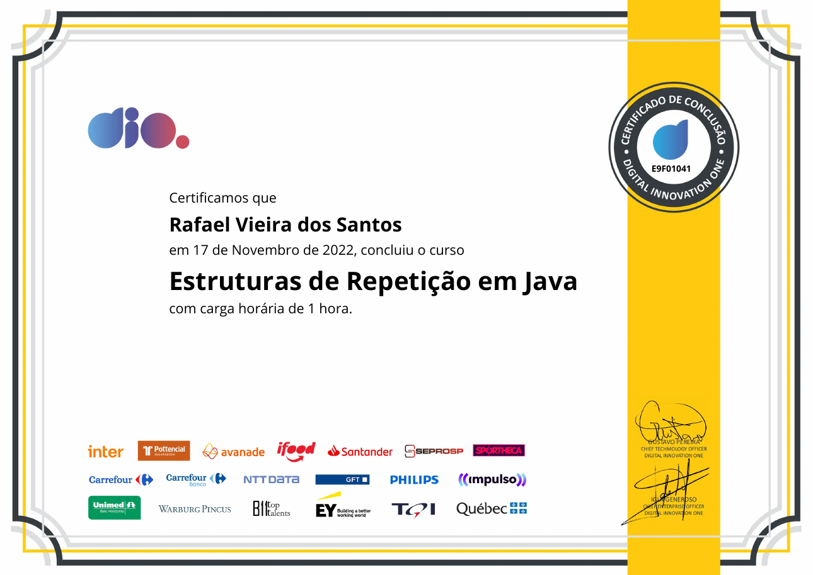

# Curso de Java oferecido pela Dio em parcia com Quebec 93 Horas
16/09/2022
## [Todos os Certificados do Curso[Neste mesmo curso]](certificados)

Somente os principais certificados dos exames:
## Introdução ao Git e GitHub

Intalação, Configuração, principais comandos, autenticação via SSH,
pull, push, merge.

## Introdução a Programação e ao Pensamento Computacional: Lógica

## Dominando IDEs Java

Instalação e uso do Netbeans, Eclipse, Intellij, Visual Studio, principais
atalhos comandos e configurações, uso do depurador, solução de dependencias.

## Variáveis, Tipos de Dados e Operadores Matemáticos em Java

## Entendendo Métodos Java

## Estruturas Condicionais com Java

## Estruturas de Repetição em Java

## Java e Tratamento de Exceções

## Trabalhando com Collections Java

## Conceitos e Melhores Práticas com Bancos de Dados PostgreSQL

19/11/22
## Programação Orientada a Objetos em Java:
### Classes, Interfaces, Herança, Polimorfismo, Abstração

