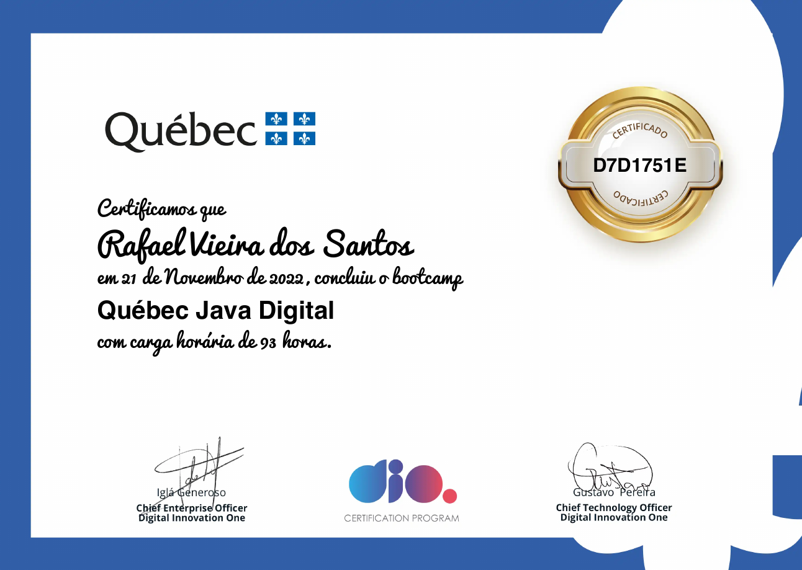

# Curso de Java oferecido pela Dio em parcia com Quebec 93 Horas
16/09/2022
## [Todos os Certificados do Curso[Neste mesmo curso]](certificados)

## Certificado do Bootcamp

Somente os principais certificados dos exames:

## Conceitos e Melhores Práticas com Bancos de Dados PostgreSQL

## Gerenciamento de Dependências e Build em Java com Maven

## Criando um Banco Digital com Java e Orientação a Objetos

## Imersão no Spring Framework com Spring Boot

Simplificando Projetos Java com o Spring Boot

## Criando uma API REST Documentada com Spring Web  Swagger

## Adicionando Segurança a uma API REST com Spring Security

## Testes Unitários com JUnit

## Deploy na Nuvem de um Conjunto de API's Desenvolvida em Spring Boot

